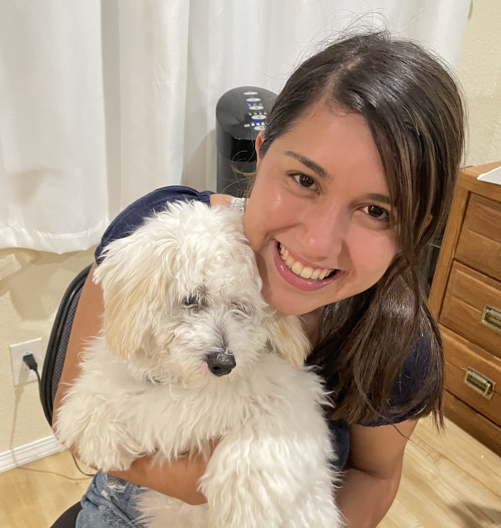

Kira Toal, Brittany Steenbergen, Elena Martinez, and Halle Vogelpohl are computer science students at LMU. Kira and Brittany are part of the class of 2023 and Elena and Halle are part of the class of 2022. They hope that you enjoy using mum! You can check out what other cool things these girls are up to by taking a look at their Githubs.

## Meet Kira

Kira Toal is a computer science and applied math double major. She enjoys going running, scrapbooking, and spending time with friends and family. She hopes that the public finds mum easy to use.



## Meet Brittany

Brittany Steenbergen is a computer science and applied math double major. She enjoys going running, scrapbooking, and spending time with friends and family. She hopes that the public finds mum easy to use.



## Meet Elena

Elena Martinez is a computer science and applied math double major. She enjoys going running, scrapbooking, and spending time with friends and family. She hopes that the public finds mum easy to use.



## Meet Halle

Halle Vogelpohl is a computer science and applied math double major. She enjoys going running, scrapbooking, and spending time with friends and family. She hopes that the public finds mum easy to use.


